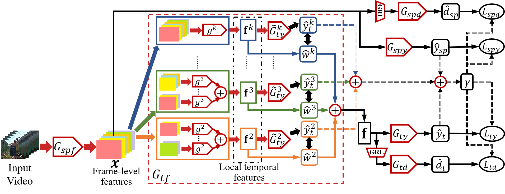

# Partial Adversarial Temporal Attentive Network (PATAN)
This repository is the demo code for the ICCV 2021 paper "Partial Video Domain Adaptation with Partial Adversarial Temporal Attentive Network". This repository is built based on the [MFNet](https://github.com/cypw/PyTorch-MFNet) repository. We thank the authors of MFNet for their excellent work.



## Prerequisites
This repository is built with PyTorch, with the following packages necessary for training and testing:
```
PyTorch (1.4.0 recommended)
opencv-python (pip)
easydl (pip)
```

## Project Detail and Dataset Download
Please visit our [project page](https://xuyu0010.github.io/pvda.html) to find out details of this work and to download the dataset.

## Training and Testing
To train the dataset, simply run:
```python
python train_da.py
```
Alternatively, you may test with the simple DANN with:
```python
python train_da.py --da-method DANN
```
To test the dataset, change directory to the '/test' folder and run:
```python
python evaluate_da.py
```

### Notes on training and testing
- The pretrained model where we start our training from can be found from [mmaction](https://github.com/open-mmlab/mmaction/blob/master/MODEL_ZOO.md).
- Notes on the '/exps' folder can be found in the README file in that folder.
- We provide a demo weight [here](https://entuedu-my.sharepoint.com/:f:/g/personal/xuyu0014_e_ntu_edu_sg/EvWxUhJtDYJIm4HNVq4kEVwBb_Dk0IVq0dm-qR0jIgQobA?e=eGbG7T), you should locate it in the '/exps' folder.